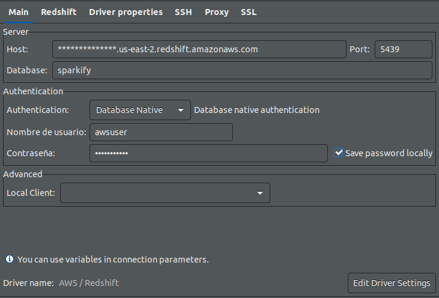
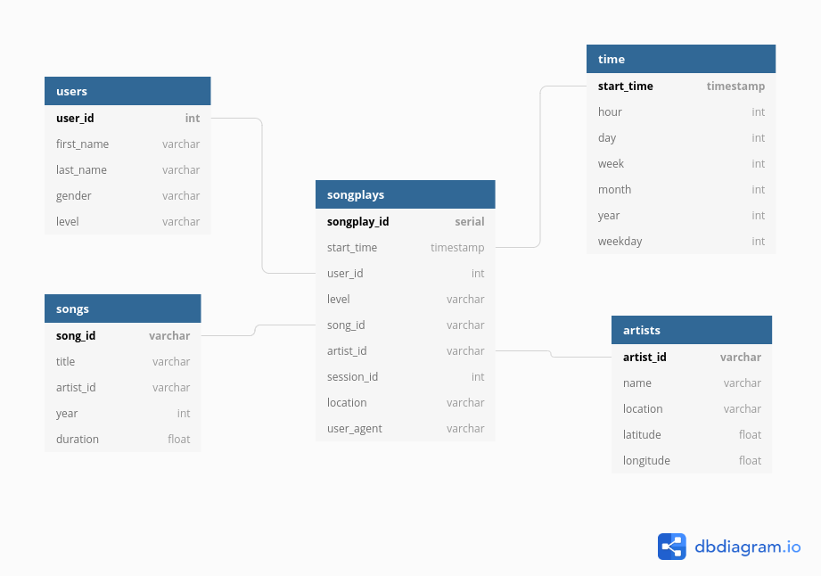

# Sparkify Redshift

## Description
This project contains files to create a Data Warehouse using Amazon Redshift which is a columnar database based on PostgreSQL. The source data comes from Amazon S3 buckets. Those files look like that:

- Songs dataset: The first dataset is a subset of real data from the [Million Song Dataset](http://millionsongdataset.com/). Each file is in JSON format and contains metadata about a song and the artist of that song. The files are partitioned by the first three letters of each song's track ID.

    Each JSON file looks like.

    ```
    {
        "num_songs": 1,
        "artist_id": "ARJIE2Y1187B994AB7"
        "artist_latitude": null,
        "artist_longitude": null,
        "artist_location": "",
        "artist_name": "Line Renaud",
        "song_id": "SOUPIRU12A6D4FA1E1",
        "title": "Der Kleine Dompfaff",
        "duration": 152.92036,
        "year": 0
    }
    ```


- Logs dataset: consists of log files in JSON format generated by this event simulator based on the songs in the dataset above. These simulate app activity logs from an imaginary music streaming app based on configuration settings.

    


## Connection to S3 buckets. 
dwh.cfg file has the needed credentials to connect with the endpoint, Redshift cluster and its IAM user associated. If you want to connect with Dbeaver fill your fields like that:



## Creating staging tables: events and songs.
From above data the staging tables were populated throught copy command.
```
copy <staging_table> from <s3_bucket>
credentials 'aws_iam_role=<arn_credential>'
json '<log_json_path | auto>'
region 'us-west-2';
```

Each column was designed based on above image. Amazon redshift allows to do a compression analysis by ``` analyze compression <table> ``` command. In the most of the cases, was applied ZSTD as compression algorithm for varchar columns.

## Creating star schema: songplays, time, songs, artists and users.

Since the objective with this project is to create and star schema, the first tables populated were the dimensions. In this case time, songs, artists and users. In the most of the cases, the data was retrived from staging_events tables. The following images ilustrates this schema.



At the end of the population on dimension tables, songsplays tables was populated taking in account the foreign keys from dimension tables. Here songsplays table accomplish with the role of facts table.

## Files description.

1. **dwh**: contains the credentials to connect with Redshift cluster.

2. **sql_queries**: contaisn needed SQL queries to drop, create, load and insert data both staging tables and star schema tables.

3. **create_tables**: starts dropping tables if these exist and the creating these again. Each actions has its own method and SQL sentences in ```sql_queries.py``` file.

4. **etl**: runs load and insert operations on tables. As you know, the load process is executed on staging tables using copy command and the insertions are executed with the insert sql command.

## If you want to run this.

1. Create an IAM role with access to S3 on AWS.
2. Create a Redshift cluster and then associate the IAM role to this cluster.
3. Fill credentials on ```dwh.cfg``` file in order to get credentials from ```sql_queries``` file.
4. Run create_tables file.
5. Run etl file.
6. If you want to see the data, you can connect throught DBeaver.